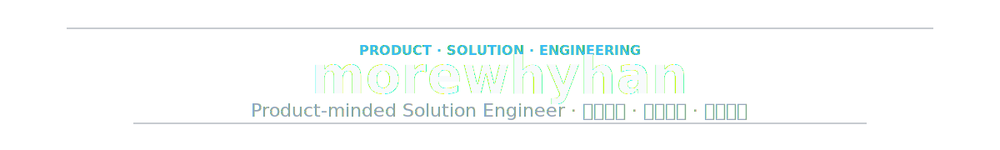
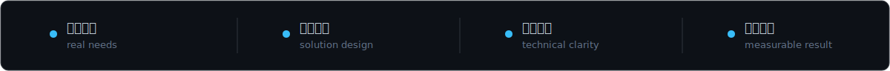
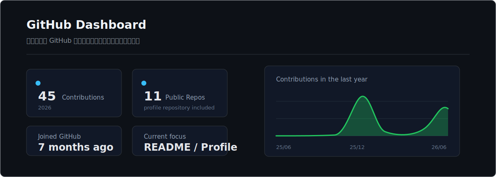
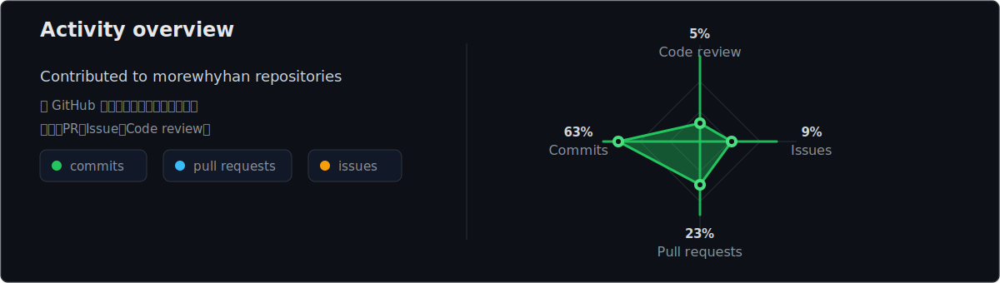
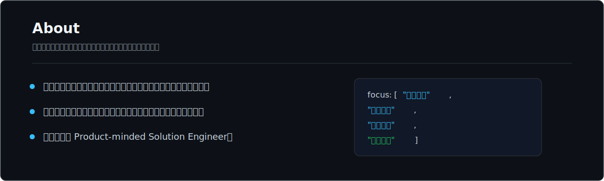
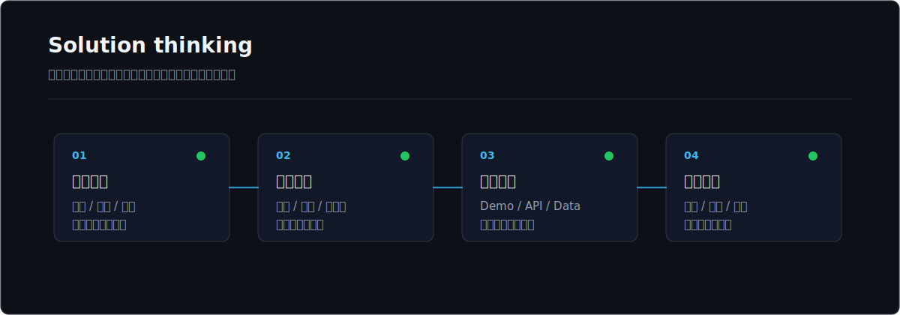
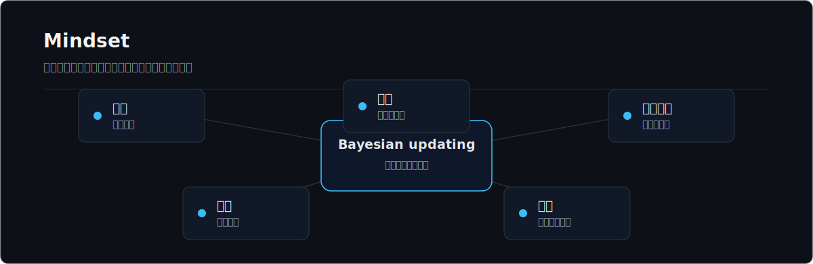
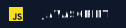
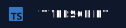
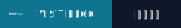

 
 

 

---

 

---

 
 

 

---

 

---

 

---

 

---

 

 

---

<table align="center" width="100%">
  <tr>
    <td width="40%" valign="top">
      <strong>虚船向远</strong> 
      记录技术笔记、阅读思考、生活观察，以及对软件产品、需求判断和协作方式的思考。  
      
    </td>
    <td width="60%" valign="top">

<!-- BLOG-POST-LIST:START -->
- [Freqtrade 量化框架使用指南](https://morewhyhan.github.io/2025/12/29/Freqtrade%20%E9%87%8F%E5%8C%96%E6%A1%86%E6%9E%B6%E4%BD%BF%E7%94%A8%E6%8C%87%E5%8D%97/) - 2025-12-29
- [服务器部署 Freqtrade 8080 ，开放 UI](https://morewhyhan.github.io/2025/12/29/%E6%9C%8D%E5%8A%A1%E5%99%A8%E9%83%A8%E7%BD%B2%20Freqtrade%208080%20%EF%BC%8C%E5%BC%80%E6%94%BE%20UI/) - 2025-12-29
- [《现代思维模式真假、好坏、对错》](https://morewhyhan.github.io/2025/11/26/%E3%80%8A%E7%8E%B0%E4%BB%A3%E6%80%9D%E7%BB%B4%E6%A8%A1%E5%BC%8F%E7%9C%9F%E5%81%87%E3%80%81%E5%A5%BD%E5%9D%8F%E3%80%81%E5%AF%B9%E9%94%99%E3%80%8B/) - 2025-11-26
- [《高效能人士的7个习惯》阅读感悟](https://morewhyhan.github.io/2025/11/25/%E3%80%8A%E9%AB%98%E6%95%88%E8%83%BD%E4%BA%BA%E5%A3%AB%E7%9A%847%E4%B8%AA%E4%B9%A0%E6%83%AF%E3%80%8B/) - 2025-11-25
- [以终为始](https://morewhyhan.github.io/2025/11/25/%E4%BB%A5%E7%BB%88%E4%B8%BA%E5%A7%8B/) - 2025-11-25
<!-- BLOG-POST-LIST:END -->

  </td>
  </tr>
</table>

---

<a href="https://github.com/morewhyhan?tab=repositories">查看我的 repositories</a>

