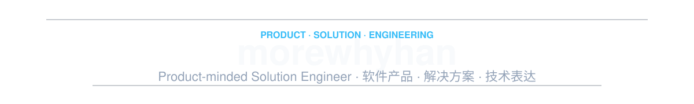
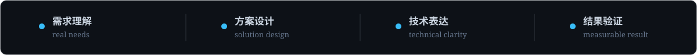
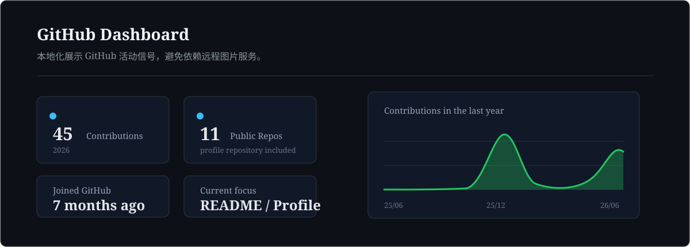
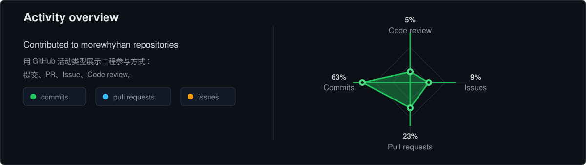
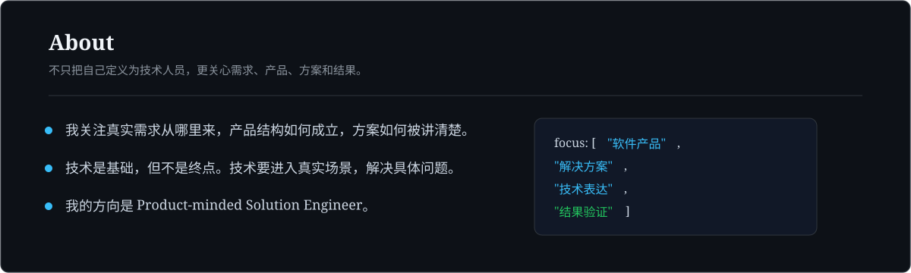
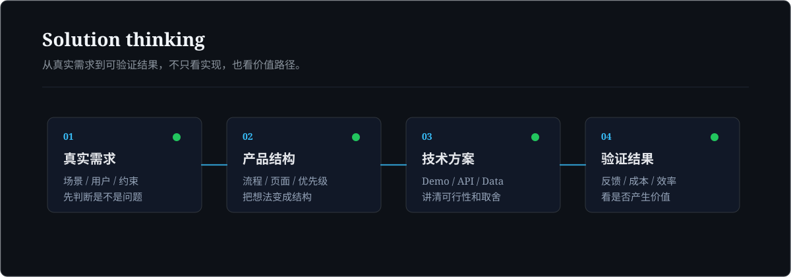
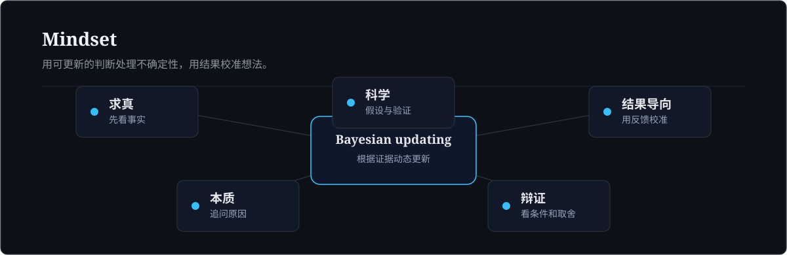

 
 

 

---

 

---

 
 

 

---

 

---

 

---

 

---

 

 

---

<table align="center" width="100%">
  <tr>
    <td width="40%" valign="top">
      <strong>虚船向远</strong> 
      记录技术笔记、阅读思考、生活观察，以及对软件产品、需求判断和协作方式的思考。  
      
    </td>
    <td width="60%" valign="top">

<!-- BLOG-POST-LIST:START -->
- [决策算法100讲](https://morewhyhan.github.io/book/decision-algorithm/) - 2026-08-28
- [奥德赛意识流](https://morewhyhan.github.io/2026/08/23/life-notes-odyssey/) - 2026-08-23
- [再挤挤](https://morewhyhan.github.io/2026/08/10/life-notes-make-room/) - 2026-08-10
- [武藏之死在天下无双](https://morewhyhan.github.io/2026/08/10/life-notes-musashi/) - 2026-08-10
- [给春稗以秋实](https://morewhyhan.github.io/2026/08/09/life-notes-autumn-fruit/) - 2026-08-09
<!-- BLOG-POST-LIST:END -->

  </td>
  </tr>
</table>

---

<a href="https://github.com/morewhyhan?tab=repositories">查看我的 repositories</a>

